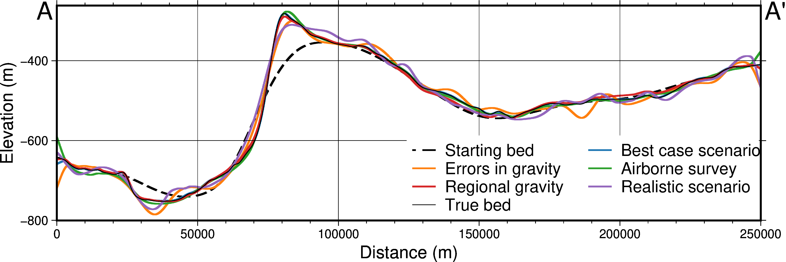
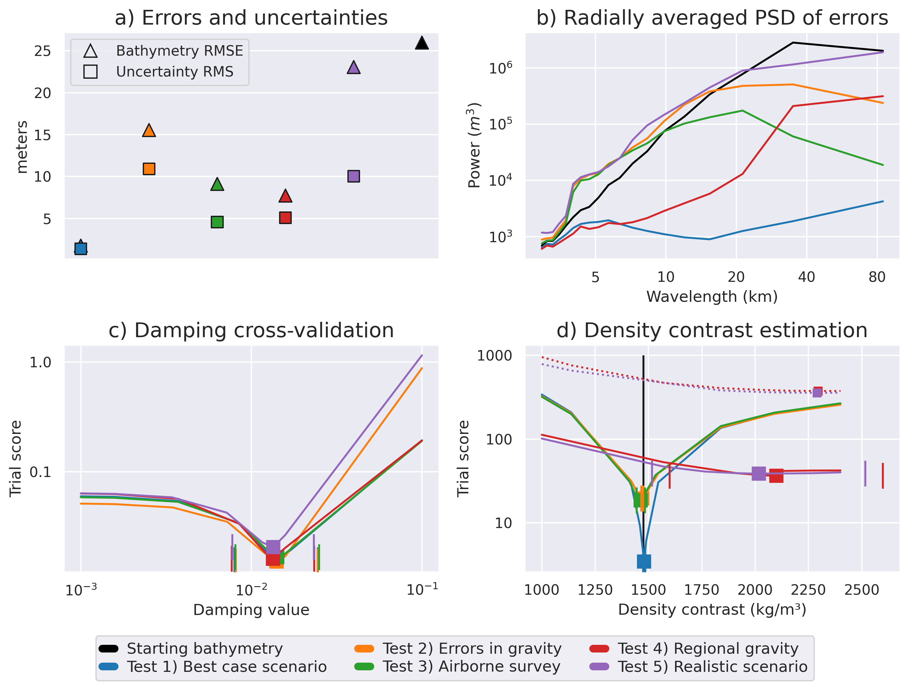

# Individual inversion scenarios (Tests 1-5)

These scenarios investigate the performance of gravity inversions for bathymetry. We use real bathymetry data to create synthetic observed gravity. The inverted bathymetry can be compared to the real bathymetry to quantify the performance of the inversion. Each of these inversions use 42 **constraint points** evenly distributed throughout the region. These represent points where the bathymetry depth is known prior to the inversion. In Antarctic ice shelf applications, these represent over-ice seismic surveys with measured sea floor depths. These points are interpolated to create a starting bathymetry model. We use bathymetry and basement topography data from the Ross Sea to calculate the synthetic observed gravity and to sample to create the starting bathymetry model.

```{image} ../paper/figures/Ross_Sea_location_figure.png
:alt: starting_model
:class: bg-primary
:width: 600px
:align: center
```

The general inversion workflow is shown in the below figure:
```{image} ../paper/figures/non_coded/inversion_workflow.png
:alt: workflow
:class: bg-primary
:width: 600px
:align: center
```

Each of these tests first estimates the optimal regularization damping parameter values, which controls the smoothness of the results, using a optimized cross-validation routine (**A** in below figure). Next, each of these tests estimates the optimal seafloor density contrast with another optimized cross-validation procedure (**B** in below figure).

```{image} ../paper/figures/non_coded/hyperparameters.png
:alt: hyperparameters
:class: bg-primary
:width: 400px
:align: center
```

Finally, the inversion with the optimally-determined values is performed, and a Monte-Carlo parameter sensitivity / uncertainty analysis is conducted to estimate spatially-variable uncertainty in the resulting bathymetry model.

```{image} ../paper/figures/non_coded/uncertainty_workflow.png
:alt: uncertainty
:class: bg-primary
:width: 400px
:align: center
```


Each test has an Jupyter Notebook, found at the bottom of this page.

The results of all the tests are summarized in the below plots:






## **Test 1: Best case scenario**
This is the simplest test, where the observed gravity is the direct forward calculation of the true bathymetry model.

```{nbgallery}
---
---
01_with_density_CV
```

## **Test 2: Gravity data noise**
This tests adds pseudo-random noise to the gravity data, with a standard deviation of 3 mGals. This noise gravity data is low-pass filtered prior to inversion, resulting in a RMSE to the true gravity of ~ 1 mGal, which is a nominal value for airborne gravity surveys.

```{nbgallery}
---
---
02_with_noise
```

## **Test 3: Airborne gravity survey**
This tests explores the effects of typical airborne survey designs. Instead of the observed gravity being full-resolution (the gravity effect of true bathymetry calculated at each point on a 2 km grid), here the observed gravity is calculated only along the flight paths of a typical Antarctic airborne survey, with spacing between E-W lines of 10 km and a spacing between N-S lines of 50 km, a 1 km altitude, and along-line spacing of 500 m. This survey data is then interpolated back to the 2 km grid prior to inversion.

```{nbgallery}
---
---
03_with_airborne_survey
```

## **Test 4: Regional gravity field**
This test adds a long-wavelength field to the observed gravity data. This regional gravity field needs to be estimated and removed from the observed signal prior to inversion.

```{nbgallery}
---
---
04_with_regional
```

## **Test 5: Realistic scenario**
This test combines all the complexities of Test 1-4 to be a semi-realistic (while still synthetic) bathymetry inversion.

```{nbgallery}
---
---
05_realistic_scenario
```

## **Analysis and manuscript figures**
This notebooks loads the results of Tests 1-5, calculates the performance metrics of each inversion, and creates the figures used in the manuscript.

```{nbgallery}
---
---
inversion_figures
```
